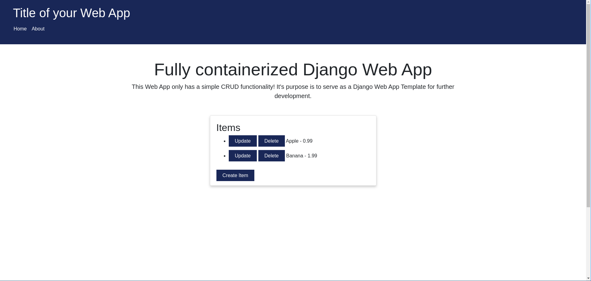

[](LICENSE)

# Fully Containerized Django Web App Development & Deployment

## Short Project Description
The project is a fully containerized Django Web App. It is a simple website that allows users to create, read, update and delete (CRUD) Items with a `name` and a `price`. The whole application is containerized with Docker and Docker Compose using Bash Scripts as Entrypoint and Multi-Stage Commands. 
It is either possible to run the application in a development environment or in a production environment to deploy it on a server instance.
The development environment uses the Django Development Server and the production environment uses Gunicorn as application server.
Additionally, both environments use PostgreSQL 12 as database server.
For deploying the application Nginx is used as a reverse proxy handling incoming requests and as static files server serving CSS, Javascript and Images.


## Dependencies
* Docker (tested with version 25.0.1)
* Docker Compose (tested with version 2.24.5 [Latest at the time of development])

To install Docker and Docker Compose on Ubuntu use the following commands (this is the official way, source: [Docker Documentation](https://docs.docker.com/engine/install/ubuntu/))
```bash
# Add Docker's official GPG key:
sudo apt-get update
sudo apt-get install ca-certificates curl
sudo install -m 0755 -d /etc/apt/keyrings
sudo curl -fsSL https://download.docker.com/linux/ubuntu/gpg -o /etc/apt/keyrings/docker.asc
sudo chmod a+r /etc/apt/keyrings/docker.asc

# Add the repository to Apt sources:
echo \
  "deb [arch=$(dpkg --print-architecture) signed-by=/etc/apt/keyrings/docker.asc] https://download.docker.com/linux/ubuntu \
  $(. /etc/os-release && echo "$VERSION_CODENAME") stable" | \
  sudo tee /etc/apt/sources.list.d/docker.list > /dev/null
sudo apt-get update

# Install Docker and Docker Compose CLI
sudo apt-get install docker-ce docker-ce-cli containerd.io docker-buildx-plugin docker-compose-plugin

# Start Docker
sudo service docker start
# Test Docker
sudo docker run hello-world

# Create a Docker Group and add your user to the group
# This will allow you to run Docker commands without using sudo
sudo groupadd docker
sudo usermod -aG docker $USER
newgrp docker
# Test Docker without sudo
docker run hello-world
```

## Setup
* To use the project you will first need to clone the project with `git clone https://github.com/scheuerdo/dockerized-django-dev-and-prod-env.git`
* Run `cd dockerized-django-dev-and-prod-env` to go into the root directory of the project.
### Development Environment
* In the folder with the name `docker` you need to create a file `.env` with the following content:<br>
`SECRET_KEY="SuperSecureDjangoSecretKey"`<br>
`DB_NAME=db_django`<br>
`DB_USER=db_user`<br>
`DB_PASSWORD=SuperSecureDbPassword`<br>
`DB_HOST=db`<br>
`DB_PORT=5432`<br>
`POSTGRES_PASSWORD=postgres`<br>

* To start up the development environment go into the `docker` folder with the command `cd docker` and then run `docker compose -f docker-compose.dev.yaml up --build`. This will start the Django development server and the database (PostgreSQL 12). The development website will be available at [http://0.0.0.0:8000/](http://0.0.0.0:8000/).

### Deployment/Production Environment
* In the folder with the name `docker` you need to create a file `.env` with the following content:<br>
`SECRET_KEY="SuperSecureDjangoSecretKey"`<br>
`DB_NAME=db_django`<br>
`DB_USER=db_user`<br>
`DB_PASSWORD=SuperSecureDbPassword`<br>
`DB_HOST=db`<br>
`DB_PORT=5432`<br>
`POSTGRES_PASSWORD=postgres`<br>

* To start up the production environment go into the `docker` folder with the command `cd docker` and then run `docker compose -f docker-compose.prod.yaml up --build`. This will start the production server (Gunicorn) and the database (PostgreSQL 12). The production website will be available at `http://<local_IPv4_address>/`, so for example `http://012.345.6.789/`. On Linux the local IPv4 address can be found with the command `hostname -I`.

### Additional Information
* You can shut down the development and production environment with the command `docker compose -f docker-compose.dev.yaml down` and `docker compose -f docker-compose.prod.yaml down` respectively.
* Of course `"SuperSecureDjangoSecretKey"` is not a secure secret key, but for the purpose of this project it is sufficient. In a real world scenario you would need to use a secure secret key. You can generate a secure secret key with the following command inside the Django container root directory i.e. the directory with the Django `manage.py`-file:<br>
`python manage.py shell -c "from django.core.management.utils import get_random_secret_key; print(get_random_secret_key())"`

### Script to create a Django Admin User (Superuser)
* To create a Django Admin User (Superuser) inside the Docker container you can use the Bash script [createDjangoSuperUser.sh](docker/scripts/createDjangoSuperUser.sh) inside the `docker/scripts` folder using `./createDjangoSuperUser.sh`. With that user you can login to the Django Admin Interface at `http://<django_app_address>/admin/` and manage the Items in the database.

### Script to create PostgreSQL Database Dumps/Backups
* To create a PostgreSQL database dump/backup from inside the Docker container you can use the Bash script [db_backup.sh](docker/scripts/db_backup.sh) using the command `scripts/db_backup.sh` inside the `docker` folder (that is needed, because the script uses the environment variables from the .env file). The Backup will be stored in the `docker/db_backups` folder with the name `db_backup_<current_date>.sql`.


## The expected Output of the Project (for comparison)
### Development Environment
* After starting the development environment for the first time with `docker compose -f docker-compose.dev.yaml up --build` the following output is expected:
```bash
...
ms_django_db  | PostgreSQL init process complete; ready for start up.
ms_django_db  | 
ms_django_db  | 2024-02-14 20:21:44.005 UTC [1] LOG:  starting PostgreSQL 12.18 (Debian 12.18-1.pgdg120+2) on x86_64-pc-linux-gnu, compiled by gcc (Debian 12.2.0-14) 12.2.0, 64-bit
ms_django_db  | 2024-02-14 20:21:44.005 UTC [1] LOG:  listening on IPv4 address "0.0.0.0", port 5432
ms_django_db  | 2024-02-14 20:21:44.005 UTC [1] LOG:  listening on IPv6 address "::", port 5432
ms_django_db  | 2024-02-14 20:21:44.010 UTC [1] LOG:  listening on Unix socket "/var/run/postgresql/.s.PGSQL.5432"
ms_django_db  | 2024-02-14 20:21:44.022 UTC [79] LOG:  database system was shut down at 2024-02-14 20:21:43 UTC
ms_django_db  | 2024-02-14 20:21:44.027 UTC [1] LOG:  database system is ready to accept connections
ms_django     | Trying to connect to database 'db_dev' on host 'db'..
ms_django     | Postgres is up! Starting the Django application...
ms_django     | Running datasbase migrations...
ms_django     | Operations to perform:
ms_django     |   Apply all migrations: admin, auth, contenttypes, core, sessions
ms_django     | Running migrations:
ms_django     |   Applying contenttypes.0001_initial... OK
ms_django     |   Applying auth.0001_initial... OK
ms_django     |   Applying admin.0001_initial... OK
ms_django     |   Applying admin.0002_logentry_remove_auto_add... OK
ms_django     |   Applying admin.0003_logentry_add_action_flag_choices... OK
ms_django     |   Applying contenttypes.0002_remove_content_type_name... OK
ms_django     |   Applying auth.0002_alter_permission_name_max_length... OK
ms_django     |   Applying auth.0003_alter_user_email_max_length... OK
ms_django     |   Applying auth.0004_alter_user_username_opts... OK
ms_django     |   Applying auth.0005_alter_user_last_login_null... OK
ms_django     |   Applying auth.0006_require_contenttypes_0002... OK
ms_django     |   Applying auth.0007_alter_validators_add_error_messages... OK
ms_django     |   Applying auth.0008_alter_user_username_max_length... OK
ms_django     |   Applying auth.0009_alter_user_last_name_max_length... OK
ms_django     |   Applying auth.0010_alter_group_name_max_length... OK
ms_django     |   Applying auth.0011_update_proxy_permissions... OK
ms_django     |   Applying auth.0012_alter_user_first_name_max_length... OK
ms_django     |   Applying core.0001_initial... OK
ms_django     |   Applying sessions.0001_initial... OK
ms_django     | Starting development server (manage.py runserver)...
ms_django     | Watching for file changes with StatReloader
ms_django     | Performing system checks...
ms_django     | 
ms_django     | System check identified no issues (0 silenced).
ms_django     | February 14, 2024 - 20:21:46
ms_django     | Django version 4.2.3, using settings 'exampleDjangoProject.settings.development'
ms_django     | Starting development server at http://0.0.0.0:8000/
ms_django     | Quit the server with CONTROL-C.
ms_django     |
```


### Deployment/Production Environment
* After starting the production environment for the first time with `docker compose -f docker-compose.prod.yaml up --build` the following output is expected:
```bash
...
ms_django_db     | PostgreSQL init process complete; ready for start up.
ms_django_db     | 
ms_django_db     | 2024-02-14 20:39:40.081 UTC [1] LOG:  starting PostgreSQL 12.18 (Debian 12.18-1.pgdg120+2) on x86_64-pc-linux-gnu, compiled by gcc (Debian 12.2.0-14) 12.2.0, 64-bit
ms_django_db     | 2024-02-14 20:39:40.081 UTC [1] LOG:  listening on IPv4 address "0.0.0.0", port 5432
ms_django_db     | 2024-02-14 20:39:40.082 UTC [1] LOG:  listening on IPv6 address "::", port 5432
ms_django_db     | 2024-02-14 20:39:40.085 UTC [1] LOG:  listening on Unix socket "/var/run/postgresql/.s.PGSQL.5432"
ms_django_db     | 2024-02-14 20:39:40.096 UTC [78] LOG:  database system was shut down at 2024-02-14 20:39:39 UTC
ms_django_db     | 2024-02-14 20:39:40.101 UTC [1] LOG:  database system is ready to accept connections
ms_django        | Trying to connect to database 'db_prod' on host 'db'..
ms_django        | Postgres is up! Starting the Django application...
ms_django        | Running database migrations...
ms_django        | Operations to perform:
ms_django        |   Apply all migrations: admin, auth, contenttypes, core, sessions
ms_django        | Running migrations:
ms_django        |   Applying contenttypes.0001_initial... OK
ms_django        |   Applying auth.0001_initial... OK
ms_django        |   Applying admin.0001_initial... OK
ms_django        |   Applying admin.0002_logentry_remove_auto_add... OK
ms_django        |   Applying admin.0003_logentry_add_action_flag_choices... OK
ms_django        |   Applying contenttypes.0002_remove_content_type_name... OK
ms_django        |   Applying auth.0002_alter_permission_name_max_length... OK
ms_django        |   Applying auth.0003_alter_user_email_max_length... OK
ms_django        |   Applying auth.0004_alter_user_username_opts... OK
ms_django        |   Applying auth.0005_alter_user_last_login_null... OK
ms_django        |   Applying auth.0006_require_contenttypes_0002... OK
ms_django        |   Applying auth.0007_alter_validators_add_error_messages... OK
ms_django        |   Applying auth.0008_alter_user_username_max_length... OK
ms_django        |   Applying auth.0009_alter_user_last_name_max_length... OK
ms_django        |   Applying auth.0010_alter_group_name_max_length... OK
ms_django        |   Applying auth.0011_update_proxy_permissions... OK
ms_django        |   Applying auth.0012_alter_user_first_name_max_length... OK
ms_django        |   Applying core.0001_initial... OK
ms_django        |   Applying sessions.0001_initial... OK
ms_django        | Collecting static files...
ms_django        | 
ms_django        | 126 static files copied to '/home/web/exampleDjangoProject/exampleDjangoProject/staticfiles'.
ms_django        | Starting production application server (Gunicorn)...
ms_django        | [2024-02-14 20:39:42 +0000] [16] [INFO] Starting gunicorn 21.2.0
ms_django        | [2024-02-14 20:39:42 +0000] [16] [INFO] Listening at: http://0.0.0.0:8000 (16)
ms_django        | [2024-02-14 20:39:42 +0000] [16] [INFO] Using worker: sync
ms_django        | [2024-02-14 20:39:42 +0000] [17] [INFO] Booting worker with pid: 17
ms_django        | [2024-02-14 20:39:42 +0000] [18] [INFO] Booting worker with pid: 18
```

### Example Image of the Website
